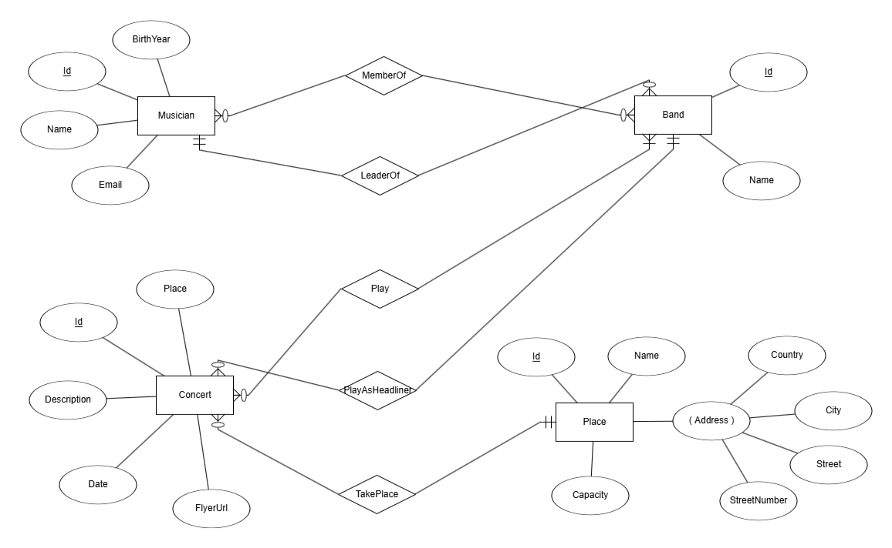
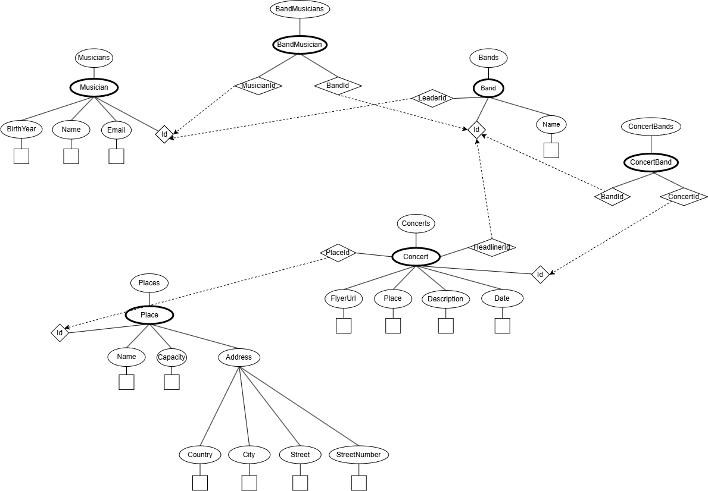

# Adatmodell ismertetése

Az alkalmazásban egy koncerteket nyilvántartó rendszert modelleztem. Ebben lehet tárolni, hogy milyen koncertek lesznek
és azok milyen helyszíneken lesznek megtartva. Továbbá tárolásra kerülnek a koncerten résztvevő zenekar, illetve az
egyes zenekarok tagjai is.

## Musician

Zenész adatai

| Tulajdonság | Leírás                      |
|-------------|-----------------------------|
| Id          | A zenész egyedi azonosítója |
| Name        | Név                         |
| BirthYear   | Születési év                |
| Email       | Email cím                   |

## Band

Zenekari adatok

| Tulajdonság | Leírás                       |
|-------------|------------------------------|
| Id          | A zenekar egyedi azonosítója |
| Name        | Zenekar neve                 |
| BandLeader  | Zenekar vezetője             |

## Concert

Koncert adatok

| Tulajdonság | Leírás                                      |
|-------------|---------------------------------------------|
| Id          | A koncer egyedi azonosítója                 |
| Place       | A hely, ahol az esemény megrendezésre kerül |
| Description | A koncert esemény leírása                   |
| Date        | A koncert időpontja                         |
| FlyerUrl    | A plakát url-je                             |

## Place

Helyszínek adatai

| Tulajdonság | Leírás                    |
|-------------|---------------------------|
| Id          | A hely egyedi azonosítója |
| Name        | Hely neve                 |
| Capacity    | Befogadóképesség (fő)     |
| Cím         | A helyszín pontos címes   |

##  ER-modell

## XDM
